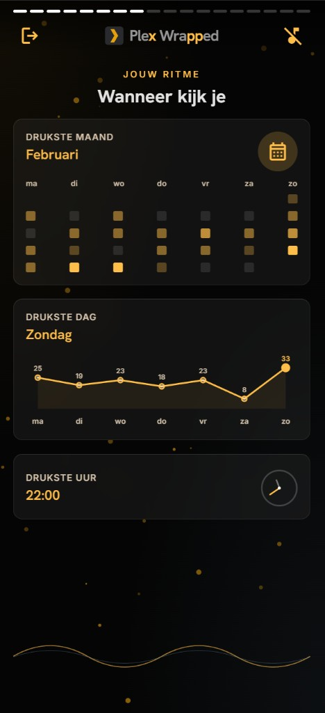
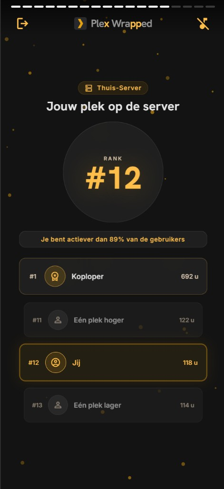
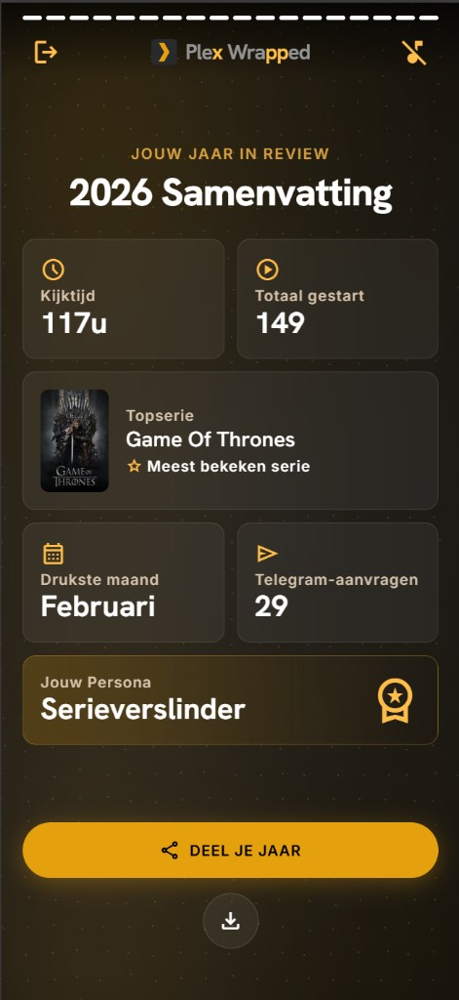

# Plex Wrapped

A mobile-first, Spotify Wrapped–style year-in-review for your Plex server. Sign in with Plex, then swipe through cinematic slides — each one a personalized stat card built from your watch history.

Built for self-hosted Plex setups that already use **Tautulli** for watch history and optionally a **Telegram bot** for film/series requests.

## Features

### Wrapped experience

Swipe through a story-style recap (tap or swipe, with optional background music):

- **Personalized welcome** — Greeting with your Plex avatar and the year’s recap title.
- **Watch time & activity** — Total hours streamed, play count, and films vs. series breakdown.
- **Top content** — Ranked top films and series with poster art from your library.
- **Series depth** — How many series, seasons, and episodes you explored.
- **Viewing rhythm** — Busiest month (heatmap), day of the week (chart), and peak hour.
- **Longest streak** — Your longest consecutive days of watching.
- **Favorite device** — Where you watch most (TV, phone, browser, etc.).
- **Server ranking** — Your place on the server leaderboard and how you compare to other users.
- **Genres** — Top movie and TV genres with share-of-total visuals.
- **Telegram integration** — Request counts, completion rate, and bot usage (when configured).
- **Viewing persona** — A fun archetype (e.g. *Serieverslinder*, *Nachtuil*) based on your habits.
- **Shareable summary** — One-screen recap card; export as a PNG or share via the native share sheet.

### Year & pre-computed cache

Stats are built in a batch job and stored in SQLite — the web app only serves cached data:

- **Pick any calendar year** — Set `WRAPPED_YEAR` in `.env` or pass `--year YYYY` to `compute_wrapped.py`.
- **Per-user rebuilds** — Recompute everyone, or a single Tautulli user with `--user-id`.
- **Force refresh** — `--force` overwrites an existing cache entry for that user/year.
- **Test fixtures** — Load sample profiles into a separate test database for UI development without Tautulli.

### AI-generated copy (Cursor, optional)

During compute, **Cursor AI** can write short Dutch punchlines in Spotify Wrapped style:

- **Batched generation** — One request produces copy for slides such as *serie diepte* and *server vs. jij*.
- **Safe fallback** — If AI is disabled or a request fails, the UI uses built-in rule-based text.
- **Verify before compute** — `python scripts/compute_wrapped.py --check-ai` tests connectivity.

See [Cursor AI (optional)](#cursor-ai-optional) for setup (`CURSOR_API_KEY`, local `cursor-agent` runtime).

### Soundtrack themes (Spotify + YouTube)

Slide music is resolved at **compute time**, not in the browser:

- **Top movies & series** — Looks up a fitting soundtrack; **Spotify** (optional) refines the search query, then **yt-dlp** downloads the clip from **YouTube** and **ffmpeg** converts it to MP3.
- **Genre slides** — Cached genre theme tracks for film and TV genre breakdowns.
- **Manual overrides** — `config/music_overrides.json` maps a title to a YouTube URL or video id when auto-search picks the wrong track.
- **Fixed slide beds** — Non-title slides get their own background tracks; everything is cached under `data/audio/cache/`.

Toggle with `MUSIC_ENABLED` / `MUSIC_DOWNLOAD_ENABLED`. Details in [Background music](#background-music).

### Sharing & access

- **In-app export** — On the summary slide, *Deel je jaar* opens the device share sheet; the download button saves a PNG of your recap.
- **Admin share links** — Create signed URLs (`POST /admin/links`) so someone can open a wrapped **without Plex login** — useful for family or social posts.
- **Link options** — Optional `year` and `max_views` in the request body; links expire after `SHARE_LINK_EXPIRY_DAYS` (HMAC-signed with `SHARE_LINK_SECRET`).
- **Plex OAuth** — Normal login uses your Plex account; `PUBLIC_URL` must match the URL users open in the browser.

See [Admin endpoints → Share links](#share-links).

### Integrations & extras

- **Tautulli** — Source of truth for watch history, server rankings, and user list.
- **TMDB** (optional) — Favorite-actor slide and poster fallbacks when Plex thumbs 404.
- **Poster proxy** (optional) — `PLEX_SERVER_URL` + token for library artwork in the UI.
- **Telegram bot export** — Link request-bot JSON to Plex users via `config/user_mapping.json`.
- **Google Analytics** (optional) — Slide and button tracking when `GOOGLE_ANALYTICS_ID` is set.

## Screenshots

<p align="center">
  
  
  
  
</p>

<p align="center">
  <em>Welcome · Viewing rhythm · Server rank · Year summary</em>
</p>

**Production deployment:** [docs/DEPLOYMENT.md](docs/DEPLOYMENT.md)

---

## Requirements

| Requirement | Notes |
|-------------|--------|
| **Python** | 3.12+ (matches the Docker image) |
| **Tautulli** | Running instance with API access (`TAUTULLI_URL`, `TAUTULLI_API_KEY`) |
| **Plex account** | Users sign in via Plex OAuth (`PLEX_CLIENT_ID`) |
| **Pre-computed cache** | Stats are batch-generated into SQLite before anyone opens `/wrapped` |
| **ffmpeg** (compute host) | System binary on `PATH` or `FFMPEG_LOCATION` — converts slide theme audio to MP3 during `compute_wrapped.py` (without it, themes fall back to M4A) |
| **yt-dlp** (compute host) | Installed via `requirements.txt`; must be on `PATH` when `MUSIC_DOWNLOAD_ENABLED=true` |
| **Optional — Telegram** | JSON export from your request bot + `config/user_mapping.json` to link Telegram IDs to Plex users |
| **Optional — TMDB** | `TMDB_API_KEY` — favorite-actor slide (cast/photos) and poster fallbacks when Plex thumbs 404 |
| **Optional — Spotify** | `SPOTIFY_CLIENT_ID` + `SPOTIFY_CLIENT_SECRET` — refines soundtrack search before YouTube lookup |
| **Optional — Cursor AI** | `CURSOR_AI_ENABLED` + `CURSOR_API_KEY` + `cursor-sdk` + local **cursor-agent** runtime on the compute host — generates Dutch punchlines during compute (see [Cursor AI](#cursor-ai-optional)) |
| **Optional — Docker** | Docker Compose provided; otherwise any host with Python 3.12 |
| **Optional — posters** | `PLEX_SERVER_URL` + `PLEX_SERVER_TOKEN` for proxied poster images |
| **Production web server** | Reverse proxy (Nginx/Caddy) + HTTPS; see [docs/DEPLOYMENT.md](docs/DEPLOYMENT.md) |

**Python dependencies** (see `requirements.txt`): FastAPI, Uvicorn, httpx, Pydantic, Jinja2, yt-dlp, cursor-sdk.

**Runtime vs compute:** Uvicorn only serves cached data. `ffmpeg`, `yt-dlp`, and Cursor AI are needed on the machine that runs `scripts/compute_wrapped.py`, not necessarily on the web server process.

---

## Quick start

1. **Copy config templates**

```bash
cp .env.example .env
cp config/user_mapping.json.example config/user_mapping.json
cp config/music_overrides.json.example config/music_overrides.json
cp data/telegram_requests.json.example data/telegram_requests.json
cp data/known_devices.json.example data/known_devices.json
```

2. **Edit `.env`**

   - **Tautulli:** `TAUTULLI_URL`, `TAUTULLI_API_KEY`
   - **Plex login:** `PLEX_CLIENT_ID` — a stable UUID you generate once and keep
   - **Public URL:** `PUBLIC_URL` must match the **exact** URL you open in the browser (e.g. `http://192.168.1.10:8000`). Using `localhost` while browsing via a LAN IP causes Plex OAuth to fail with “We were unable to complete this request.”
   - **Secrets:** `SECRET_KEY`, `ADMIN_SECRET`, `SHARE_LINK_SECRET`

3. **Map Telegram users** (if you use request stats)

   Edit `config/user_mapping.json` — link Telegram user IDs to Plex `user_id` values from Tautulli → Users.

4. **Point at your Telegram export**

   Set `TELEGRAM_REQUESTS_PATH` to your bot's JSON file.

5. **Install and run**

```bash
python -m venv .venv
source .venv/bin/activate   # Linux / macOS / WSL
# .venv\Scripts\activate    # Windows

pip install -r requirements.txt
uvicorn app.main:app --reload --host 0.0.0.0 --port 8000
```

6. **Install ffmpeg** (recommended on the compute host)

```bash
# Debian/Ubuntu
sudo apt install ffmpeg

# macOS
brew install ffmpeg

# Windows (winget)
winget install Gyan.FFmpeg
```

Verify with `ffmpeg -version`. If the binary is not on `PATH`, set `FFMPEG_LOCATION` in `.env` to the executable or its directory.

7. **Pre-compute wrapped stats** (required before anyone opens their recap)

```bash
python scripts/compute_wrapped.py --year 2025
```

The app serves **cached** stats only. Opening `/wrapped` without a cache entry shows a “not generated yet” message.

| Flag | Description |
|------|-------------|
| `--year YYYY` | Calendar year to summarize (default: `WRAPPED_YEAR` from `.env`) |
| `--force` | Recompute even when a cache entry already exists |
| `--user-id N` | Compute a single Tautulli user id only |
| `-v` / `--verbose` | Enable DEBUG logging |
| `--check-ai` | Verify Cursor AI connectivity and exit (no compute) |

8. Open `http://localhost:8000` (or your `PUBLIC_URL`) and sign in with Plex.

---

## Local UI testing (no Tautulli batch)

Test data lives in a **separate** SQLite file (`data/wrapped_test.db`), not production `data/wrapped.db`.

```bash
# One user (default: user_id 1)
python scripts/load_test_wrapped.py --user-id 1

# All users listed in data/fixtures/test_users.json
python scripts/load_test_wrapped.py --all-test-users

# Custom fixture for a single user
python scripts/load_test_wrapped.py --user-id 3 --fixture data/fixtures/wrapped_test_films_only.json
```

| Flag | Description |
|------|-------------|
| `--year YYYY` | Wrapped year (default: `WRAPPED_YEAR`) |
| `--user-id N` | Plex/Tautulli user id to store under (default: `1`) |
| `--all-test-users` | Load every user in `data/fixtures/test_users.json` |
| `--fixture PATH` | Override fixture JSON for a single `--user-id` load |

In `.env`:

```env
USE_TEST_DATABASE=true
```

With `USE_TEST_DATABASE=true`, **login does not need Tautulli** — your Plex account is matched via `test_users.json`, `user_mapping.json`, or cached rows in `wrapped_test.db`.

Edit fixtures under `data/fixtures/` and register users in `test_users.json`. Each fixture must be **one** JSON object (do not paste multiple profiles into one file).

| User ID | Fixture | Scenario |
|--------|---------|----------|
| 1 | `wrapped_test.json` | Full profile (films + series + telegram) |
| 2 | `wrapped_test_user2.json` | Film-heavy mixed viewer |
| 3 | `wrapped_test_films_only.json` | Movies only, no series |
| 4 | `wrapped_test_series_only.json` | Series only, no movies |
| 5 | `wrapped_test_telegram_only.json` | Telegram only, no watch history |
| 6 | `wrapped_test_no_activity.json` | No activity at all |
| 7 | `wrapped_test_light_viewer.json` | Light viewer, minimal stats |
| 8 | `wrapped_test_mixed_low_completion.json` | Mixed + low telegram completion |
| 9 | `wrapped_test_no_telegram.json` | Full watch profile, no telegram usage |

---

## Background music

Slide themes are resolved during **compute**, not at page load. `compute_wrapped.py` downloads short theme clips via **yt-dlp** (YouTube) and converts them to MP3 with **ffmpeg**. Cached files live under `data/audio/cache/` and are served from `/api/audio/{filename}`.

1. Copy optional per-title overrides:

```bash
cp config/music_overrides.json.example config/music_overrides.json
```

Edit `movies` / `shows` keys with a YouTube URL or video id when automatic search picks the wrong track.

2. Relevant `.env` settings:

| Variable | Default | Description |
|----------|---------|-------------|
| `MUSIC_ENABLED` | `true` | Attach per-slide music URLs to the cached payload |
| `MUSIC_DOWNLOAD_ENABLED` | `true` | Download missing themes at compute time (`false` = use cache only) |
| `AUDIO_CACHE_PATH` | `data/audio/cache` | Downloaded theme files |
| `MUSIC_OVERRIDES_PATH` | `config/music_overrides.json` | Manual YouTube overrides per title |
| `FFMPEG_LOCATION` | *(empty)* | Path to `ffmpeg` binary or its directory |
| `SPOTIFY_CLIENT_ID` / `SPOTIFY_CLIENT_SECRET` | *(empty)* | Optional — better soundtrack search queries |

`load_test_wrapped.py` keeps music metadata but skips downloads (`MUSIC_DOWNLOAD_ENABLED=false` internally).

Legacy helper `scripts/setup_audio_placeholders.py` can still create silent genre/year MP3 fallbacks; compute no longer requires it.

---

## Cursor AI (optional)

When enabled, compute asks Cursor for short Dutch punchlines on select slides (series depth, server comparison, etc.). Failures are non-fatal — the UI falls back to rule-based copy.

1. Get an API key at [cursor.com/dashboard](https://cursor.com/dashboard) (Integrations / API Keys).
2. Install the **cursor-agent** local runtime on the compute host (required by `cursor-sdk` for local mode). The Python package alone is not enough.
3. In `.env`:

```env
CURSOR_AI_ENABLED=true
CURSOR_API_KEY=cursor_...
CURSOR_MODEL=auto
CURSOR_TIMEOUT_SECONDS=120
# CURSOR_AGENT_CWD=          # optional; empty = project root
```

4. Verify before a full compute run:

```bash
python scripts/compute_wrapped.py --check-ai
```

---

## Admin endpoints

All admin routes require the `X-Admin-Secret` header (value from `ADMIN_SECRET` in `.env`).

### Share links

Create a signed URL that opens a user's wrapped **without** Plex login:

```bash
curl -X POST http://localhost:8000/admin/links \
  -H "X-Admin-Secret: your-admin-secret" \
  -H "Content-Type: application/json" \
  -d "{\"plex_user_id\": 1}"
```

Returns a URL like `http://localhost:8000/w/...`.

Optional body fields: `year`, `max_views`.

### List unique devices

Collect every distinct Plex **player name** seen across all Tautulli users. Use this to discover which device icons you need (e.g. for the “Jouw scherm” slide) before adding custom artwork:

```bash
curl http://localhost:8000/admin/devices \
  -H "X-Admin-Secret: your-admin-secret"
```

Example response:

```json
{
  "count": 8,
  "names": ["Apple TV", "Chrome", "iPhone", "LG webOS TV", "NVIDIA SHIELD Android TV", "Samsung TV", "iPad", "Plex Web"],
  "devices": [
    {
      "name": "Apple TV",
      "platform": "tvOS",
      "platform_name": "Apple TV",
      "total_plays": 450,
      "users": ["Alice", "Bob"]
    }
  ]
}
```

- `names` — flat list sorted by popularity (handy to paste into a design brief)
- `devices` — per-device metadata: Tautulli `platform`, which users use it, and total play counts

Player names match the `favorite_device` value shown in each user's wrapped recap.

Device icons for the *Jouw scherm* slide are resolved in `static/js/device-icons.js` from `data/known_devices.json` (copy `data/known_devices.json.example` or save `GET /admin/devices` output). Regenerate after adding new players:

```bash
python scripts/generate_device_icons.py
```

Similar devices share one icon (for example all LG and Samsung TVs use `tv`, all iPhones use `phone_iphone`).

### Health check

```bash
curl http://localhost:8000/health
```

Returns `200` when Tautulli is reachable, or `503` with an error message when it is not.

---

## Scripts reference

| Script | Purpose |
|--------|---------|
| `scripts/compute_wrapped.py` | Pre-compute production cache (+ slide music, optional AI). See flags above. |
| `scripts/load_test_wrapped.py` | Load fixture JSON into `data/wrapped_test.db`. See flags above. |
| `scripts/generate_device_icons.py` | Regenerate `static/js/device-icons.js` from `data/known_devices.json` (see `data/known_devices.json.example`) |
| `scripts/setup_audio_placeholders.py` | Legacy — create silent genre/year MP3 placeholders (optional) |

---

## Data formats

### User mapping (`config/user_mapping.json`)

```json
{
  "1234567890": {
    "plex_user_id": 1,
    "plex_username": "joe_plex",
    "plex_email": "joe@example.com",
    "display_name": "Joe"
  }
}
```

The top-level key is the **Telegram user ID**. `plex_user_id` must match Tautulli's user id.

### Telegram requests (`data/telegram_requests.json`)

```json
{
  "1234567890": {
    "logins": { "23-01-2025 15:35:49": "Joe" },
    "film_requests": { "19-05-2025 14:43:25": "Movie Title" },
    "serie_requests": { "23-01-2025 15:36:21": "Show Title" }
  }
}
```

Dates use `DD-MM-YYYY HH:MM:SS`.

### Music overrides (`config/music_overrides.json`)

Optional per-title YouTube overrides when automatic theme search is wrong:

```json
{
  "movies": {
    "The Dark Knight": "https://www.youtube.com/watch?v=xxxxxxxxxxx"
  },
  "shows": {
    "Game of Thrones": "AdQ3JDLlmPI"
  }
}
```

Values can be a full YouTube URL or a bare video id. Keys are matched against Plex/Tautulli titles (with fuzzy prefix matching).

---

## Running on a web server

For production (HTTPS, reverse proxy, systemd, scheduled cache rebuilds), see **[docs/DEPLOYMENT.md](docs/DEPLOYMENT.md)**.

Quick summary:

1. Set `PUBLIC_URL` to your public `https://` URL (required for Plex OAuth and share links).
2. Run Uvicorn on `127.0.0.1:8000` — do not expose it directly to the internet.
3. Put **Nginx** or **Caddy** in front for TLS (example configs in `deploy/`).
4. Run `compute_wrapped.py` after deploy and on a schedule (cron example in `deploy/`).

Example files in [`deploy/`](deploy/):

| File | Purpose |
|------|---------|
| `nginx.conf.example` | Reverse proxy to Uvicorn |
| `plex-wrapped.service.example` | systemd service (no `--reload`) |
| `compute-wrapped.cron.example` | Nightly cache rebuild |
| `env.production.example` | Production `.env` starting point |

### Docker

```bash
docker compose up -d --build
docker compose exec plex-wrapped python scripts/compute_wrapped.py --year 2025
```

Mount `.env`, `data/`, `config/user_mapping.json`, and `config/music_overrides.json` as in `docker-compose.yml`. The default image does **not** include the `ffmpeg` system binary — extend the Dockerfile or run compute on the host if you need MP3 theme downloads. Put a reverse proxy in front for HTTPS — details in [docs/DEPLOYMENT.md](docs/DEPLOYMENT.md).

---

## Configuration

| Variable | Description |
|----------|-------------|
| `PUBLIC_URL` | Public URL for OAuth redirects and share links (must match browser URL) |
| `WRAPPED_YEAR` | Calendar year to summarize |
| `SECRET_KEY` | Session signing secret |
| `SESSION_MAX_AGE` | Session cookie lifetime (seconds) |
| `LOG_LEVEL` | Application log level |
| `TAUTULLI_URL` | Tautulli base URL |
| `TAUTULLI_API_KEY` | Tautulli API key |
| `PLEX_CLIENT_ID` | Stable UUID for Plex OAuth |
| `PLEX_PRODUCT` | Product name sent to Plex (default: `PlexWrapped`) |
| `ADMIN_SECRET` | Header secret for `/admin/*` endpoints |
| `SHARE_LINK_SECRET` | HMAC secret for share tokens |
| `SHARE_LINK_EXPIRY_DAYS` | Share link validity (days) |
| `USER_MAPPING_PATH` | Path to Telegram ↔ Plex mapping JSON |
| `TELEGRAM_REQUESTS_PATH` | Path to Telegram bot request export |
| `DATABASE_PATH` | Production SQLite cache path |
| `TEST_DATABASE_PATH` | Test SQLite cache path |
| `USE_TEST_DATABASE` | `true` to use test DB and relaxed login |
| `TELEGRAM_BOT_TOKEN` | Optional — bot token for login/share alerts |
| `TELEGRAM_CHANNEL_ID` | Optional — channel/chat ID for alerts |
| `GOOGLE_ANALYTICS_ID` | Optional — GA4 measurement ID for slide tracking |
| `PLEX_SERVER_URL` / `PLEX_SERVER_TOKEN` | Optional poster proxy |
| `TMDB_API_KEY` | Optional — favorite-actor slide and TMDB poster fallback |
| `MUSIC_ENABLED` | Enable per-slide background music in cached payloads |
| `MUSIC_DOWNLOAD_ENABLED` | Download themes during compute (vs cache-only) |
| `AUDIO_CACHE_PATH` | Directory for downloaded theme audio |
| `MUSIC_OVERRIDES_PATH` | JSON map of title → YouTube URL/id overrides |
| `FFMPEG_LOCATION` | Path to `ffmpeg` binary or directory (compute host) |
| `SPOTIFY_CLIENT_ID` / `SPOTIFY_CLIENT_SECRET` | Optional soundtrack search refinement |
| `CURSOR_AI_ENABLED` | Enable AI punchlines during compute |
| `CURSOR_API_KEY` | Cursor API key (compute host) |
| `CURSOR_MODEL` | Cursor model id (default: `auto`) |
| `CURSOR_TIMEOUT_SECONDS` | Max seconds per AI request |
| `CURSOR_AGENT_CWD` | Working directory for the local Cursor agent |
| `WRAPPED_TEST_FIXTURE_PATH` | Default fixture for `load_test_wrapped.py` |
| `WRAPPED_TEST_USERS_PATH` | Registry of test users for `--all-test-users` |

---

## License

GPL-3.0 (see [LICENSE](LICENSE))
