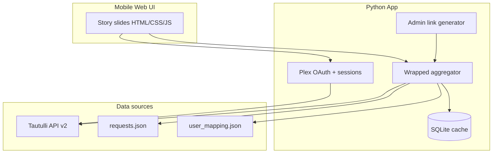

# Plex Wrapped — Brainstorm & Implementation Plan

> Saved from project planning. Implementation status: **V2** (see [README.md](../README.md) for how to run).

## Product vision

A Spotify Wrapped–style experience for your Plex server: full-screen vertical “cards” users swipe through on mobile, personalized to **calendar year** (e.g. 1 Jan–31 Dec 2025), with optional **server-wide comparison** slides. Two ways in:

1. **Plex login** — user signs in with Plex; app verifies they exist on your server (via Tautulli’s user list).
2. **Admin share link** — you generate a signed, per-user URL so they can open their wrapped without logging in again (link is the secret).

Python is a strong fit here (Tautulli client, JSON parsing, auth, background jobs). No need to switch languages unless you later want a separate native app.

---

## Localization


| Layer                                             | Language       |
| ------------------------------------------------- | -------------- |
| Plan, code, API field names, README               | English        |
| Wrapped UI (labels, headlines, personas, summary) | **Dutch (nl)** |


Media titles stay in their original language from Plex/Tautulli. Month/day chart labels are mapped to Dutch in the aggregator before caching.

---

## Slide deck V2 (numbered for design)

**16–19 slides** depending on Telegram activity. Dutch display copy below.

### Opening (1–4)


| #   | ID             | Dutch copy                                                                                           | Data keys                                              |
| --- | -------------- | ---------------------------------------------------------------------------------------------------- | ------------------------------------------------------ |
| 1   | `welcome`      | **Hoi {display_name}!** · Jouw {year} Plex Wrapped                                                   | `display_name`, `avatar_url`, `year`                   |
| 2   | `watch_time`   | *Kijktijd* · **{watch_hours} uur** · Dat is **{watch_days} dagen kijkplezier** · gestreamd in {year} | `watch_hours`, `watch_days`, `total_watch_seconds`     |
| 3   | `total_plays`  | *Totaal gestart* · **{total_plays}** · keer op play voor films & series                              | `total_plays` (= `movie_plays` + `tv_plays`, no music) |
| 4   | `movies_vs_tv` | *Films vs series* · **{movie_plays} films** · **{tv_plays} afleveringen**                            | `movie_plays`, `tv_plays`                              |


### Top content (5–7)


| #   | ID             | Dutch copy                                                                                               | Data keys                                            |
| --- | -------------- | -------------------------------------------------------------------------------------------------------- | ---------------------------------------------------- |
| 5   | `top_movies`   | *Topfilms* · list 1–5 with plays                                                                         | `top_movies[]`                                       |
| 6   | `top_shows`    | *Topseries* · list 1–5 with episode counts                                                               | `top_shows[]`                                        |
| 7   | `series_depth` | *Jouw seriesreis* · {unique_series} series · {unique_seasons} seizoenen · {unique_episodes} afleveringen | `unique_series`, `unique_seasons`, `unique_episodes` |


No #1 movie/show slides, no most-watched episode.

### When & how (8–12)


| #   | ID                 | Dutch copy                                                | Data keys                                        |
| --- | ------------------ | --------------------------------------------------------- | ------------------------------------------------ |
| 8   | `when_you_watch`   | *Wanneer kijk je* · Drukste maand/dag/uur                 | `busiest_month`, `peak_day`, `peak_hour` (Dutch) |
| 9   | `favorite_device`  | *Jouw scherm* · {favorite_device}                         | `favorite_device`                                |
| 10  | `longest_streak`   | *Langste streak* · **{longest_streak_days} dagen op rij** | `longest_streak_days`                            |
| 11  | `top_movie_genres` | *Filmgenres* · top 5                                      | `top_movie_genres[]`                             |
| 12  | `top_show_genres`  | *Seriesgenres* · top 5                                    | `top_show_genres[]`                              |


No stream-quality slide.

### Server (13–14)


| #   | ID                   | Dutch copy                                                          | Data keys                                                                  |
| --- | -------------------- | ------------------------------------------------------------------- | -------------------------------------------------------------------------- |
| 13  | `server_rank`        | *Op de server* · **#{rank}** · tussen kijkers (no total user count) | `server.rank`                                                              |
| 14  | `server_vs_you_show` | *Server vs jij* · Server #1 serie vs jouw serie                     | `server.server_top_show`, `user_comparison_show`, `user_comparison_reason` |


User series: most-played show if any series has `plays > 1` (episodes), else first series watched in the year.

### Telegram (15–17, conditional)


| #   | ID                              | Dutch copy                                                 | Data keys                                                                  |
| --- | ------------------------------- | ---------------------------------------------------------- | -------------------------------------------------------------------------- |
| 15  | `telegram_requests_split`       | *Aanvragen* · films / series counts (no total)             | `telegram.film_requests`, `telegram.serie_requests`                        |
| 16  | `telegram_requested_vs_watched` | *Aanvraag → kijken* · unique requested vs watched per type | `movies_requested`, `movies_watched`, `series_requested`, `series_watched` |
| 17  | `telegram_logins`               | *Botgebruik* · {login_count}                               | `telegram.login_count`                                                     |


### Closing (18–19)


| #   | ID              | Dutch copy                                                                                                                | Data keys                                                                                                     |
| --- | --------------- | ------------------------------------------------------------------------------------------------------------------------- | ------------------------------------------------------------------------------------------------------------- |
| 18  | `persona_crown` | *Jouw kroon* · Op basis van jouw stats word je gekroond tot **{persona}** · {persona_tagline}                             | `persona`, `persona_tagline`, `persona_id`                                                                    |
| 19  | `summary_card`  | *{year} samenvatting* · kijktijd, totaal gestart, topserie (fallback topfilm), drukste maand, telegram-aanvragen, persona | `watch_hours`, `total_plays`, `top_shows`/`top_movies`, `busiest_month`, `telegram.total_requests`, `persona` |


Persona **before** summary. Empty state: *Geen activiteit in {year}*.

### Personas (Dutch, priority order)


| persona_id       | Title             | Tagline                              | Rule (summary)                      |
| ---------------- | ----------------- | ------------------------------------ | ----------------------------------- |
| curator          | De Curator        | Je vraagt meer aan dan je scrollt.   | ≥10 unique requests & >30% of plays |
| series_devourer  | Serieverslinder   | Afleveringen zijn je comfortfood.    | tv_plays > 2× movie_plays           |
| film_buff        | Filmliefhebber    | Films zijn jouw hoofdprogramma.      | movie_plays > 2× tv_plays           |
| marathon_runner  | Marathonloper     | Je meet het leven in uren.           | watch_hours ≥ 300                   |
| binge_royalty    | Binge-koning(in)  | Streaks zijn je superkracht.         | longest_streak_days ≥ 7             |
| night_owl        | Nachtuil          | De server gloeit na 22:00.           | peak_hour ≥ 22                      |
| early_bird       | Vroege vogel      | Eerste licht, eerste play.           | peak_hour ≤ 8                       |
| completionist    | De Voltooier      | Je proeft van alles.                 | unique_series ≥ 15                  |
| genre_explorer   | Genreverkenner    | Je kiest niet één pad.               | ≥6 distinct genres                  |
| weekend_warrior  | Weekendstrijder   | Za en zo is showtijd.                | peak_day zaterdag/zondag            |
| loyal_rewatcher  | Trouwe herkijker  | Favorieten verdienen een herkansing. | top movie plays ≥ 3                 |
| dedicated_viewer | Toegewijde kijker | Stabiel en trouw.                    | default                             |


---

## Cache-only runtime

- **Batch:** `python scripts/compute_wrapped.py --year YYYY [--force]` materializes all stats into SQLite `wrapped_cache`.
- **Runtime:** `GET /api/wrapped` reads cache only. On miss → `503` with `{ "ready": false, "message": "..." }` — **no** live Tautulli calls.
- Genre metadata and server top movie are fetched during batch only (`get_metadata`, `get_home_stats`).
- Posters still use `/api/poster` (Plex token).

---

## Architecture




### Recommended stack

- **Backend:** FastAPI (lightweight API + static files)
- **Frontend:** Server-rendered shell + vanilla JS for swipe/progress
- **Cache:** SQLite table `wrapped_cache(user_id, year, payload_json, computed_at)`
- **Config:** `.env` for `TAUTULLI_URL`, `TAUTULLI_API_KEY`, `PLEX_CLIENT_ID`, `ADMIN_SECRET`, `SHARE_LINK_SECRET`, paths to JSON files

### Identity linking (critical path)

Three identifiers must converge for one person:


| ID                         | Role                                                                   |
| -------------------------- | ---------------------------------------------------------------------- |
| Plex `user_id`             | From OAuth + Tautulli `get_users` / `get_user_names` — **primary key** |
| Tautulli history `user_id` | Filter all watch stats                                                 |
| Telegram numeric ID        | Key in `requests.json`                                                 |


**Mapping file** (`config/user_mapping.json`):

```json
{
  "8229502993": {
    "plex_user_id": 12345,
    "plex_username": "Joe",
    "plex_email": "joe@example.com",
    "display_name": "Joe"
  }
}
```

- On Plex login: resolve `plex_user_id` from OAuth (match Tautulli user by email/username via `get_users`).
- Load Telegram stats: lookup `telegram_id` where `plex_user_id` matches.
- Reject login if user not in Tautulli `get_users` (not on your server).

**Plex OAuth flow** (server-side only):

1. `POST https://plex.tv/api/v2/pins` → pin id + code
2. Redirect user to `https://app.plex.tv/auth#?...` with `forwardUrl` back to `/auth/callback`
3. Poll pin until `authToken` present
4. `GET https://plex.tv/api/v2/user` with token → Plex account
5. Match to Tautulli user; store session cookie (httpOnly)

**Admin share links:** `GET /w/{token}` where token = HMAC-signed payload: `{plex_user_id, year, exp}`.

---

## Tautulli data strategy


| Need                      | API                                                                                                     |
| ------------------------- | ------------------------------------------------------------------------------------------------------- |
| User list / verify access | `get_users`, `get_user`                                                                                 |
| Raw plays in date range   | `get_history` with `user_id`, `start_date`, `end_date`, `grouping=1`, paginate `start`/`length`         |
| Charts                    | `get_plays_by_dayofweek`, `get_plays_by_hourofday`, `get_plays_per_month` with `user_id` + `time_range` |
| Devices                   | `get_user_player_stats`                                                                                 |
| Server ranks              | `get_plays_by_top_10_users` (no user filter)                                                            |


**Aggregation approach:**

1. **Batch job:** `python scripts/compute_wrapped.py --year 2025` pre-warms cache for all mapped users (required before users open wrapped).
2. **No on-demand fallback:** API returns 503 if cache miss.

---

## Telegram JSON integration (V1)

**File:** `data/telegram_requests.json` (gitignored; see `data/telegram_requests.json.example`).

**Canonical format:**

```json
{
  "8229502993": {
    "logins": {
      "23-01-2025 15:35:49": "Joe",
      "19-05-2025 14:43:01": "Joe"
    },
    "film_requests": {
      "19-05-2025 14:43:25": "The Man Who Knew Infinity"
    },
    "serie_requests": {
      "23-01-2025 15:36:21": "30 Rock"
    }
  }
}
```

- Top-level keys: **Telegram user IDs** (strings).
- Date keys: `DD-MM-YYYY HH:MM:SS` — filter to wrapped calendar year.
- `logins` values are display names; matching uses `user_mapping.json`, not login values.

**Per user, for year Y:**

- Split `film_requests` / `serie_requests` event counts
- Unique titles requested vs unique titles watched (fuzzy match per type)
- `logins` count (bot usage)

---

## Access control

**Who can view a wrapped:**

1. **Plex login** — must authenticate with Plex and be on your server (Tautulli `get_users`).
2. **Admin share link** — signed URL per user; URL is the credential.


| Rule                      | Implementation                                                                    |
| ------------------------- | --------------------------------------------------------------------------------- |
| Only Plex server users    | After OAuth, `plex_user_id` must exist in Tautulli `get_users`                    |
| Admin share link per user | `POST /admin/links` with `X-Admin-Secret` → `{plex_user_id, year}` → `/w/{token}` |
| Link security             | HMAC-SHA256, expiry (default 90 days), optional `max_views` in DB                 |
| No cross-user leakage     | Session/token binds one `plex_user_id`; API never accepts user id from client     |


Do **not** expose Tautulli API key or raw `telegram_requests.json` to the browser.

---

## Mobile UX (story format)

- `100dvh` per slide, scroll-snap vertical + tap-to-advance
- Segmented progress bar at top
- Dark gradients, poster art via backend proxy
- `prefers-reduced-motion` respected

---

## Project structure (as built)

```
plex-wrapped/
├── app/
│   ├── main.py
│   ├── auth/plex_oauth.py
│   ├── tautulli/client.py
│   ├── telegram/loader.py
│   ├── wrapped/aggregator.py
│   ├── wrapped/slides.py
│   ├── admin/links.py
│   └── models/
├── config/
│   └── user_mapping.json.example
├── data/
│   └── telegram_requests.json.example
├── static/
├── templates/
├── scripts/
│   └── compute_wrapped.py
├── docs/
│   └── PLAN.md          ← this file
├── requirements.txt
└── .env.example
```

---

## Implementation phases


| Phase        | Status | Scope                                                                 |
| ------------ | ------ | --------------------------------------------------------------------- |
| 1 Foundation | Done   | FastAPI, Tautulli client, JSON loaders, health check                  |
| 2 Auth       | Done   | Plex OAuth, sessions, admin share links                               |
| 3 Aggregator | Done   | Year stats, Telegram, SQLite cache, persona                           |
| 4 Mobile UI  | Done   | Story slides, progress bar, poster proxy                              |
| 5 Deploy     | Done   | `compute_wrapped.py`, Docker, README                                  |
| 6 V2 slides  | Done   | 19-slide deck, Dutch UI, cache-only API, genres, streak, server movie |


---

## Config checklist


| Item                     | Purpose                      |
| ------------------------ | ---------------------------- |
| Tautulli URL + API key   | All watch stats              |
| Plex `client_id` (UUID)  | OAuth                        |
| `user_mapping.json`      | Telegram ID ↔ `plex_user_id` |
| `telegram_requests.json` | Request/login history        |
| `ADMIN_SECRET`           | Protect `/admin/links`       |
| `PUBLIC_URL`             | OAuth redirect + share links |


---

## Risks & mitigations


| Risk                                | Mitigation                                               |
| ----------------------------------- | -------------------------------------------------------- |
| Large `get_history` pagination slow | Pre-compute cache; `grouping=1`                          |
| Plex user ↔ Tautulli mismatch       | Map by email + username; manual override in mapping JSON |
| Telegram date format `DD-MM-YYYY`   | Strict parser; tests in `tests/test_telegram.py`         |
| Poster URLs need Plex token         | Backend image proxy (`PLEX_SERVER_URL` + token)          |
| Users with no data in year          | Empty state; still show Telegram stats if any            |


---

## Success criteria

- User logs in with Plex and sees only their wrapped if on the server
- Admin can generate a working share link per user
- V2 slide deck (numbered 1–19, Dutch copy)
- Stats scoped to calendar year (`WRAPPED_YEAR`)
- Mobile-first, swipeable story UI
- Cache-only API — no Tautulli calls on page load
- Pre-compute via `compute_wrapped.py` before sharing links

