# Slide gallery

Every slide in the Plex Wrapped story, in the order they are built by
[`buildSlides()`](../../static/js/wrapped.js).

Most slides are conditional — they only appear when the underlying data exists
(no favourite actor, no actor slide). The numbers below are the positions in a
full run; a user with less history simply sees a shorter deck. The example
screenshots come from a Dutch-language run, so the copy is in Dutch.

| # | Slide | Shown when | Preview |
|---|-------|-----------|---------|
| 1 | **Welcome** (`welcome`) | Always |  |
| 2 | **Watch time** (`watch-time`) | Watch history exists | 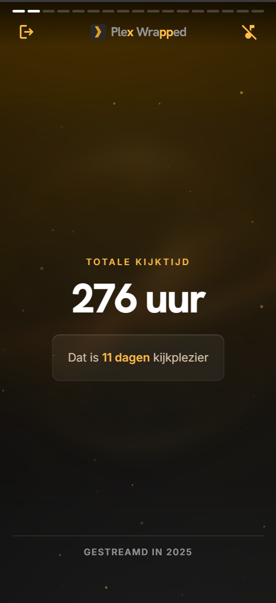 |
| 3 | **Total plays** (`total-plays`) | Watch history exists | 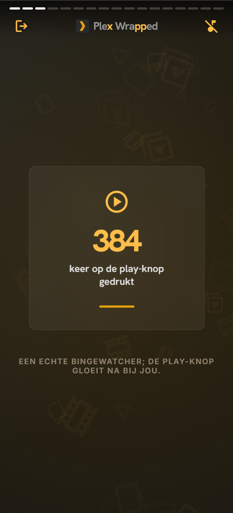 |
| 4 | **Films vs series** (`movies-vs-tv`) | Watch history exists | 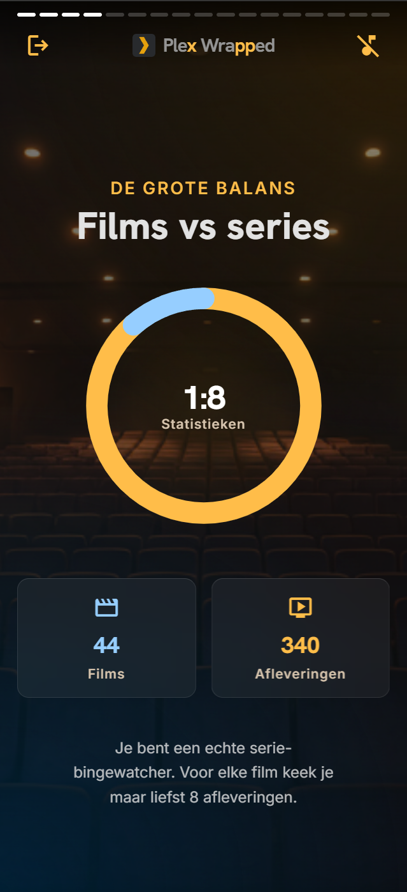 |
| 5 | **Top 5 films** (`top-movies`) | At least 3 different films watched | 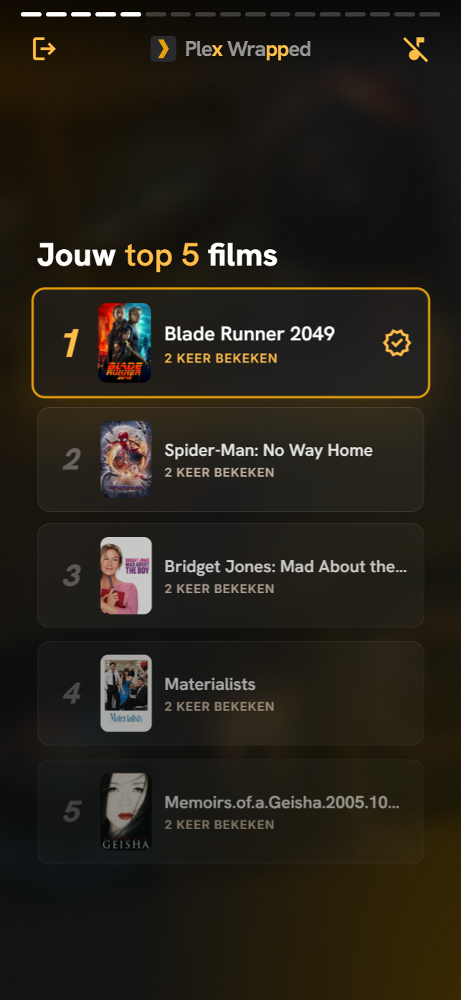 |
| 6 | **Top 5 series** (`top-shows`) | 3 different series, or 2 series with more than 5 episodes, or 1 series with more than 10 episodes | 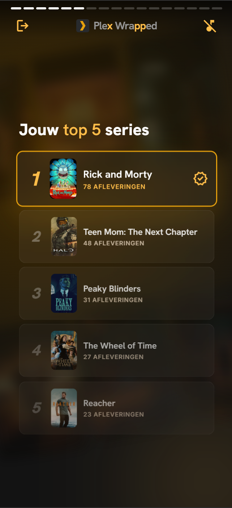 |
| 7 | **Series depth** (`series-depth`) | More than 1 series, more than 1 season, or more than 10 episodes | 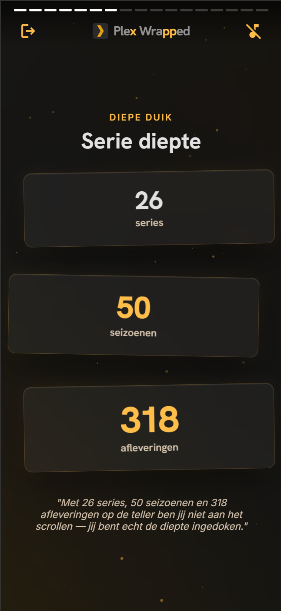 |
| 8 | **When you watch** (`when-you-watch`) | A busiest month, day, or hour is known | 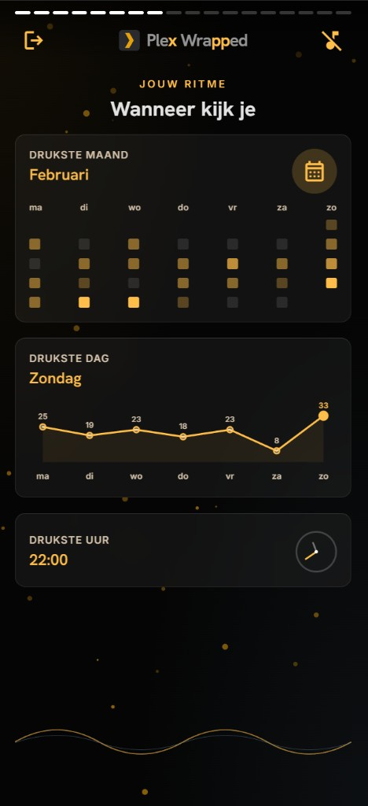 |
| 9 | **Favourite device** (`favorite-device`) | A favourite device is known | 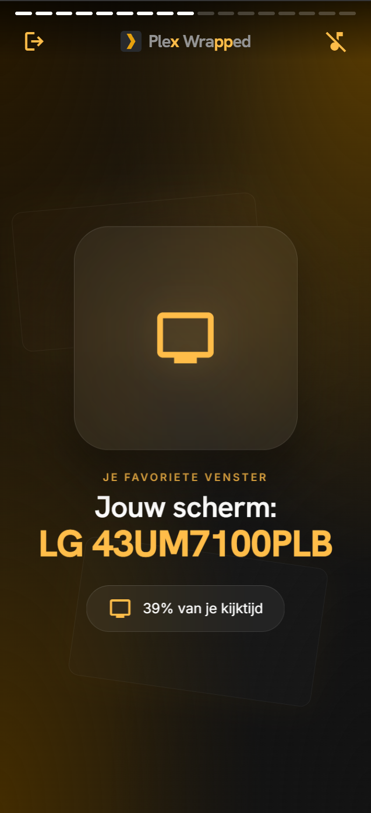 |
| 10 | **Longest streak** (`longest-streak`) | Streak of at least 3 days | 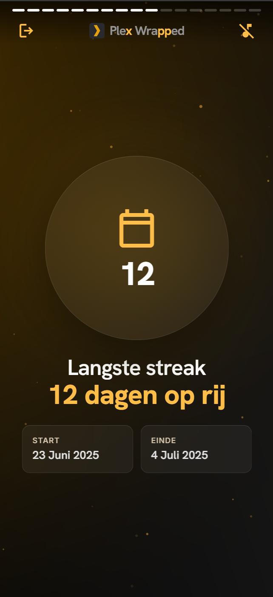 |
| 11 | **Favourite actor** (`favorite-actor`) | TMDB returned a top actor |  |
| 12 | **Top film genres** (`movie-genres`) | Film genres available, and the top 5 films slide is shown | 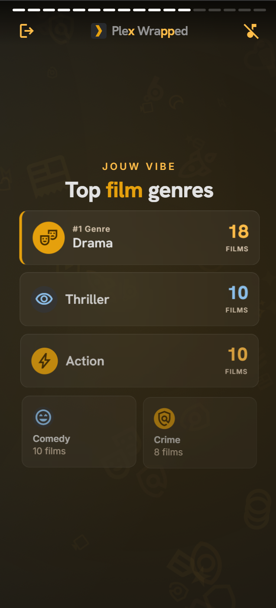 |
| 13 | **Top series genres** (`show-genres`) | Series genres available, and the top 5 series slide is shown | 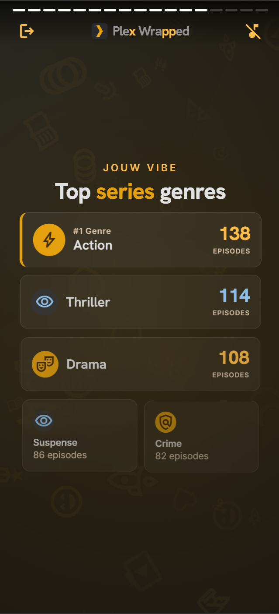 |
| 14 | **Server rank** (`server-rank`) | Server leaderboard data available | 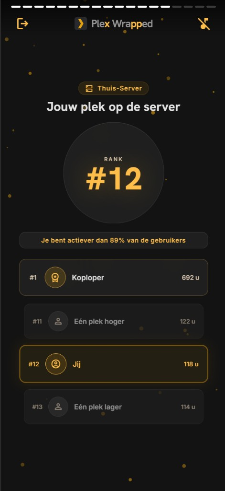 |
| 15 | **Server vs you** (`server-vs-you`) | Both a server top show and a personal top show exist | 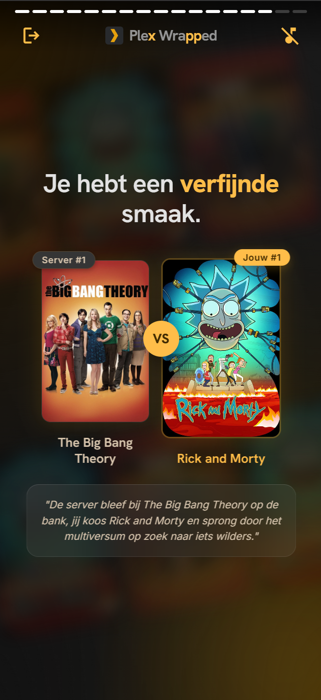 |
| 16 | **Telegram requests** (`telegram-requests`) | Telegram request activity exists | _not captured_ |
| 17 | **Your crown** (`persona`) | Always |  |
| 18 | **Year summary** (`summary`) | Always | 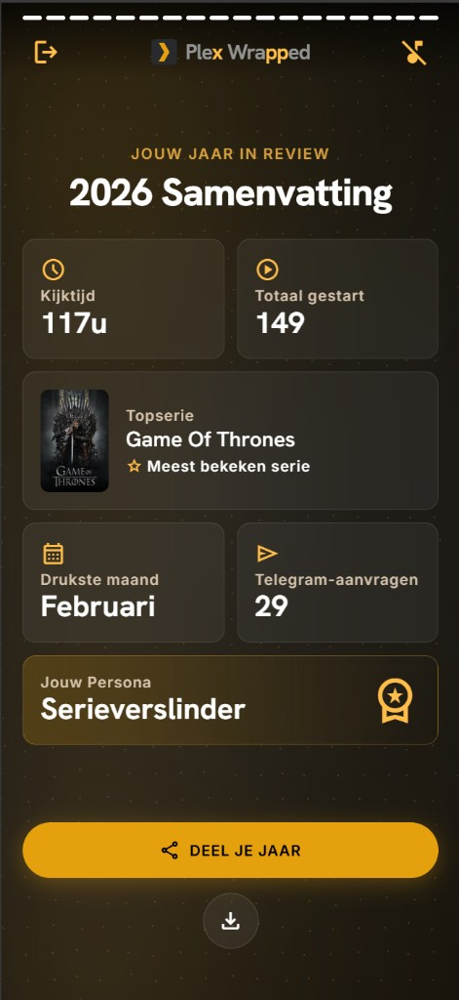 |

## Updating a screenshot

Open a wrapped in the browser, navigate to the slide, and capture the viewport
at mobile width. Save it over the existing file using the same name — the file
name matches the slide id used in `buildSlides()`, so the gallery keeps working
without touching this table.
